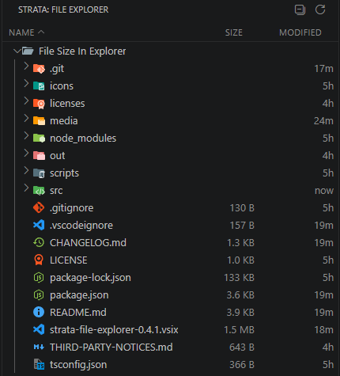

<p align="center">
  
</p>

<h1 align="center">Strata – File Explorer</h1>

<p align="center">
  A lightweight, fast file explorer for VS Code — file &amp; folder sizes, modified
  dates, and colorful icons in clean, sortable, resizable columns.
</p>

<p align="center">
  <a href="https://marketplace.visualstudio.com/items?itemName=FlashCosmos.strata-file-explorer"></a>
  
  
</p>

---

Strata adds a sidebar view that shows your workspace as a clean, sortable table with the
columns the built-in Explorer can't display: **file size**, **folder size**, and
**modified date**. It's styled with VS Code's own theme variables and icons, so it looks
like it shipped with the editor — and it stays out of your way: **zero runtime
dependencies, no telemetry, no network calls.**

Because it reads file metadata through the extension host, it works transparently over
**Remote-SSH**, Dev Containers, and WSL — connect to a remote machine and browse it with
full size/date columns, as if you were local.

<p align="center">
  
</p>

## Why Strata?

VS Code's built-in Explorer can't show extra columns. The only inline text an extension
can add there is a **2-character badge** — far too small for a real file size. Strata
sidesteps that with its own view rendered to match your theme, giving you a true
"details" layout without giving up the native feel.

## Features

- 📏 **File & folder sizes** — folder sizes are computed **lazily** (only when you expand
  or hover a folder), so heavy trees like `node_modules` never slow you down.
- 🗓️ **Modified column** — relative times (`5m`, `3h`, `2d`) then compact dates; full
  timestamp on hover.
- ↕️ **Sortable columns** — click a header to sort by name, size, or date.
- ↔️ **Resizable columns** — drag the header dividers; widths persist across reloads.
- 🎨 **Colorful, type-aware icons** via the bundled Material Icon Theme, plus faint indent
  guides — all matching your active color theme (light, dark, high-contrast).
- 🌐 **Remote-friendly** — works over Remote-SSH / Dev Containers / WSL out of the box.
- 🪶 **Lightweight** — zero runtime dependencies, no telemetry, no network; fonts and
  icons are bundled (no CDN).

## Settings

| Setting | Default | Description |
| --- | --- | --- |
| `strata.computeFolderSizes` | `true` | Compute folder sizes lazily (on expand/hover). |
| `strata.foldersFirst` | `true` | Sort folders before files. |
| `strata.excludeHidden` | `false` | Hide dot-files and dot-folders. |
| `strata.sizeUnits` | `binary` | `binary` (1 KB = 1024 B) or `decimal` (1 KB = 1000 B). |

## Requirements

- VS Code **1.84** or newer.

## Install

Search for **"Strata File Explorer"** in the Extensions view (`Ctrl+Shift+X`), or install
from the command line:

```bash
code --install-extension FlashCosmos.strata-file-explorer
```

Then open the **Strata** icon in the Activity Bar.

## Building from source

```bash
npm install        # also copies Codicon assets into media/
npm run compile    # or: npm run watch  (press F5 to launch an Extension Dev Host)
npm run package    # produces a .vsix
```

## Credits

File-type icons are from the [Material Icon Theme](https://github.com/material-extensions/vscode-material-icon-theme)
(MIT) by Philipp Kief. See [THIRD-PARTY-NOTICES.md](THIRD-PARTY-NOTICES.md).

## License

[MIT](LICENSE) © FlashCosmos
